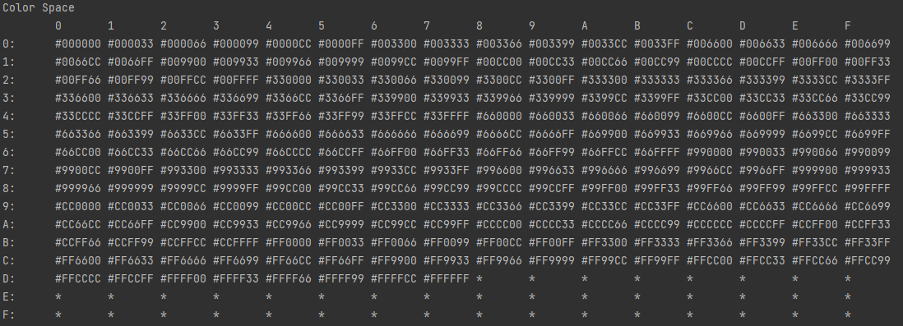
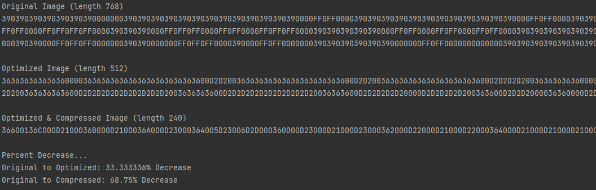

# A PixelMap image storage implementation

## Background
I was just introduced to the [following puzzle](https://pixelmap.medium.com/tiles-hex-triplets-gas-prices-and-the-compression-contest-3adcfebcf3ac); being a sucker for a good coding puzzle, I decided to give it a shot with a (probably naive) implementation. This implementation primarily does two things to save on space when storing, as a string, a 16x16 pixel image that consists of only [web safe colors](https://htmlcolorcodes.com/color-chart/web-safe-color-chart/).

## Implementation
* Instead of storing each pixel as three characters which were the web safe color code as hex singlets, why not reduce each color to two characters. 
* Add on a basic compression algorithm, optimize the storage of consecutive colors.

As I was implementing this as an NPM package, I created (a somewhat hacky) implementation of a PixelMapImage class to make working with the images easier, this encapsulates the colorspace logic; however, the compression code is separate.
Take a look at the tests in [src/__tests__/PixelMapImageSqueezer.tests.ts](./src/__tests__/PixelMapImageSqueezer.tests.ts) for a working example.

### Color Space
To reduce each pixel to two characters to store the colors, I decided to map the web safe colors to a 16x16 grid, effectively creating a 256 color "color space" to work with. Now, each color could be represented by a two character hex string. `#000000` becomes `00` and `#FFFFFF` becomes `D7` (Note `D8` through `FF` are unused in this implementation).



Recreating the image from Kens example (formatted for viewing)

```
390390390390390390390000000390390390390390390390
390390390390390390000FF0FF0000390390390390390390
390390390390390390000FF0FF0000390390390390390390
390390390390390000FF0FF0FF0FF0000390390390390390
000000000000000000FF0FF0FF0FF0000000000000000000
000FF0FF0FF0FF0FF0FF0FF0FF0FF0FF0FF0FF0FF0FF0000
390000FF0FF0FF0FF0000FF0FF0000FF0FF0FF0FF0000390
390390000FF0FF0FF0000FF0FF0000FF0FF0FF0000390390
390390390000FF0FF0000FF0FF0000FF0FF0000390390390
390390390000FF0FF0FF0FF0FF0FF0FF0FF0000390390390
390390000FF0FF0FF0FF0FF0FF0FF0FF0FF0FF0000390390
390390000FF0FF0FF0FF0FF0FF0FF0FF0FF0FF0000390390
390000FF0FF0FF0FF0FF0000000FF0FF0FF0FF0FF0000390
390000FF0FF0FF0000000390390000000FF0FF0FF0000390
000FF0FF0000000390390390390390390000000FF0FF0000
000000000390390390390390390390390390390000000000
```
becomes shortened to
```
36363636363636000036363636363636
36363636363600D2D200363636363636
36363636363600D2D200363636363636
363636363600D2D2D2D2003636363636
000000000000D2D2D2D2000000000000
00D2D2D2D2D2D2D2D2D2D2D2D2D2D200
3600D2D2D2D200D2D200D2D2D2D20036
363600D2D2D200D2D200D2D2D2003636
36363600D2D200D2D200D2D200363636
36363600D2D2D2D2D2D2D2D200363636
363600D2D2D2D2D2D2D2D2D2D2003636
363600D2D2D2D2D2D2D2D2D2D2003636
3600D2D2D2D2D20000D2D2D2D2D20036
3600D2D2D2000036360000D2D2D20036
00D2D200003636363636360000D2D200
00000036363636363636363636000000
```

### Saving More Space
The previous step reduces images from a length of 768 to a length of 512; however, looking at the sample image Ken provided, there is a lot of repeating colors. I'm betting that a lot of the images will benefit at least *some* from squeezing repeating colors together.

This step will take all colors, eliminate duplicates and store several pixels as three characters. Worst case scenario (an image where no pixels repeat), we have gained no compression benefit; however, we have not made our storage worse either since the original used three characters per pixel anyways. I decided the easiest way to do this without any fancy encoding would be to combine like colors (up to 16) and then use a hex code for the number (0 = 1, F = 16). If an image contained more than 16 repeating colors it would be listed multiple times in groups of up to 16 to add up to the total amount (this is the naive part).

Taking the first 16 pixels (32 characters) from the above image in our color space (formatted for clarity):
```
36 36 36 36 36 36 36 00 00 36 36 36 36 36 36 36
```
Is now be compressed to the following 9 characters:
```
366 001 36C
```
This can be read as:
* 36 seven times
* 00 twice
* 36 thirteen times? Yes. Since the same color starts the next row, we actually saved _even more_ space!

The fully encoded and compressed image from Ken's original post is now only 240 characters!
```
36600136C000D2100036B000D2100036A000D23000364005D23006D2D000360000D23000D21000D23000362000D22000D21000D22000364000D21000D21000D21000365000D27000364000D29000363000D29000362000D24001D24000361000D22001361001D22000360000D21001365001D21003369002
```

## Data
As of now, I only have a single image to test with; however, here are the results...

